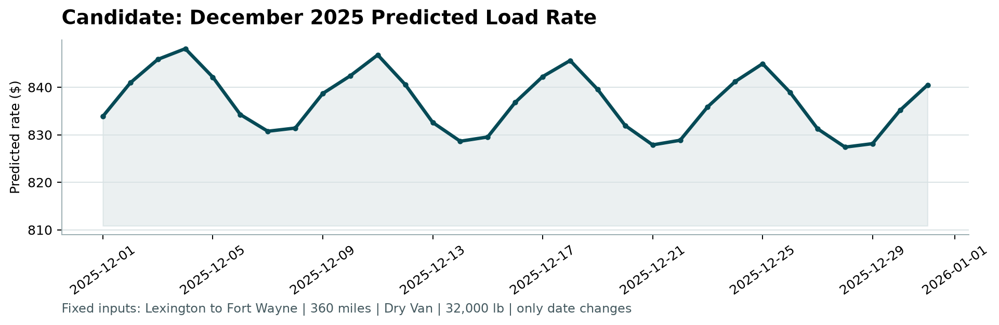

# Spotter Freight Rate Modeling Report

## Executive summary

I treated this as a forward forecasting problem. The 48,000 labeled rows run
from January 1 through October 31, 2025, and the 12,000 unlabeled rows are the
next 61 days. Model development therefore uses January-July for fitting, August
for all configuration choices and early stopping, and September-October as an
untouched 61-day holdout.

The August-selected model is LightGBM with native pickup, delivery, and
equipment categories, an L1 objective, and a log target. It deliberately uses
the common columns available in every inference file. On the one-time
September-October evaluation it achieved **$109.76 MAE, $634.36 RMSE, 4.75%
MAPE, and 0.8272 R2**. That improves the former engineered-ridge winner by
6.1% on MAE and 14.2% on MAPE. It did not reach the independently supplied
$100 MAE target, and no value was hardcoded or adjusted to resemble that
benchmark.

The winning configuration was refit on all 48,000 labeled rows. The official
scorer validates all 12,000 submission predictions and all 31 December chart
rows.

## Data exploration and key findings

### Coverage, chronology, and overlap

- `train_test.csv` contains 48,000 unique loads, 14 columns, and 304
  consecutive dates from 2025-01-01 through 2025-10-31. Rows and sequential
  `TR-` IDs are chronological.
- `validation.csv` contains 12,000 unique loads and the same 13 predictors;
  only `posted_rate` is absent. It covers the following 61 consecutive dates,
  2025-11-01 through 2025-12-31. Its `TE-` IDs exactly match the prediction
  template in set and order.
- Development contains 64 pickup cities, 64 delivery cities, three equipment
  types, and 4,014 directed pickup-delivery combinations. Validation contains
  4,214 lanes: 3,478 shared and 736 validation-only lanes across 1,461 rows.
  Eight pickup/delivery labels are new in validation; all equipment types are
  shared.
- Distance and coordinate distributions are broadly stable. `market_index` is
  the important exception: validation is 0.93 development standard deviations
  lower on average. This is another reason a shuffled split would be optimistic.

### Associations with price

Distance is the dominant predictor. Its raw Pearson correlation with
`posted_rate` is 0.9085, while the correlation between log distance and log
rate is 0.9674. Rate per mile declines with distance, so a flat rate-per-mile
rule cannot represent the relationship. Equipment also matters: development
mean rates are $2,271.55 for Dry Van, $2,445.09 for Flatbed, and $2,553.64 for
Reefer.

The target has a long right tail up to $25,533. These values are positive and
not provably erroneous, so I retained them and tested loss functions and target
transforms that are robust to their influence.

### Integrity checks

There are no duplicate IDs, exact duplicate rows, duplicate feature rows,
blank categorical strings, invalid dates, non-positive distances, non-positive
targets, infinite values, or invalid coordinates. Each city maps consistently
to one coordinate pair. Reported distance is coherent with great-circle
distance: their Pearson correlation is 0.9995, and no reported distance is
shorter than the great-circle distance.

The complete printed audit is in `output/eda/exploration.log`; supporting CSVs
are under `output/eda/`.

## Data-quality issues and cleaning decisions

| Issue | Development | Validation | Treatment and rationale |
|---|---:|---:|---|
| Missing weight | 300 | 165 | Use the training median for the same equipment, then the global training median as fallback. |
| Negative weight | 292 | 145 | Take the absolute value and retain a correction flag. Absolute negative-weight quantiles closely match valid positive weights, consistent with a sign-flip entry error. |
| Missing `market_index` | 374 | 249 | Use the same-day median from other loads in that input batch, then the training-global median as fallback. This preserves the daily macro signal without using the target. |

Imputers and category levels are fitted only on the applicable training slice.
Missing/corrected-value flags remain available to the models. Dates and
`quote_signal` were complete; future violations fail fast rather than receiving
an arbitrary synthetic value.

## Validation and split approach

| Partition | Dates | Rows | Purpose |
|---|---|---:|---|
| Inner training | 2025-01-01 to 2025-07-31 | 33,718 | Fit candidate configurations |
| Early-stopping/tuning | 2025-08-01 to 2025-08-31 | 4,759 | Choose objective, target transform, hyperparameters, feature set, and iteration count |
| Final holdout | 2025-09-01 to 2025-10-31 | 9,523 | One reporting evaluation per frozen variant; no further tuning |

The holdout is adjacent to training and has the same 61-day length as final
inference. This preserves realistic direction of time. A random split would
allow later market conditions to inform predictions for earlier loads.

MAE is the primary selection metric because it directly represents typical
absolute dollar error. MAPE provides a scale-relative view. RMSE and R2 are
reported for transparency but do not drive selection.

## Why native-categorical LightGBM

### 1. Category interactions instead of an additive one-hot model

The original linear path one-hot encodes pickup, delivery, and equipment. It
can add an origin effect and a destination effect but cannot naturally learn
that a particular pairing behaves differently. LightGBM instead receives all
three as pandas categorical columns through `categorical_feature`, allowing a
tree path to condition on combinations. This is justified by the observed 64
by 64 city space and 4,014 realized lanes.

I also tested an explicit 4,014-level lane category. It worsened August MAE
from $86.82 to $88.43 in the common-column search, so the final model leaves it
out. The pickup and delivery splits can learn useful interactions while sharing
strength across sparse lanes.

### 2. L1 loss for rare, largely unpredictable extreme labels

I fit a reasonable robust baseline on January-July and defined an audit-only
extreme as `posted_rate / baseline_prediction >= 2.5`. This identifies 209 of
33,718 rows, or 0.620%, with ratios from 2.505 to 5.329. Across the numeric
features, the largest absolute standardized mean difference is 0.147 and every
two-sample KS p-value is at least 0.156. Categorical Cramer's V is at most
0.052. A sparse chi-square test detects a delivery-mix difference, but its
effect size is tiny; the available columns do not explain the extreme label
magnitude.

The objective screen supports the robust-loss argument. On August, at the same
representative configuration:

| Features | Target | L1 MAE | L2 MAE |
|---|---|---:|---:|
| Full | Raw | $117.24 | $204.61 |
| Full | Log | $114.78 | $143.04 |
| Common | Raw | $88.83 | $184.38 |
| Common | Log | $87.88 | $127.78 |

L2 lets rare squared residuals dominate the fit; L1 is much more stable here.

### 3. Multiplicative target structure

The stronger 0.9674 log-log correlation versus 0.9085 raw correlation suggests
that proportional effects are closer to the data-generating process than fixed
dollar increments. Under L1, the representative log target improved August
MAE from $117.24 to $114.78 for full features and from $88.83 to $87.88 for
common features. After tuning, the common L1/log model reached $85.77 August
MAE and was frozen at 4,083 iterations.

On the final holdout the raw-target common diagnostic happened to post $109.40
MAE versus $109.76 for log target. I did not switch to it after seeing that
result: the log model had already won the August comparison. This preserves the
meaning of the untouched holdout.

### Hyperparameter findings

The August search covered the requested leaf, learning-rate, and child-size
neighborhood with 5,000 trees as the ceiling and 100-round early stopping. The
selected common model uses 63 leaves, learning rate 0.02, minimum child size
12, unlimited depth, categorical smoothing/L2 of 10, and 80% row and feature
sampling. No-subsampling was explicitly tested; mild sampling improved August
MAE from $86.82 to $85.77, so the data did not support retaining 100% sampling.
Seeds and LightGBM deterministic mode make the result reproducible.

## Model comparison and selection

Every number is from September-October. Hyperparameters and the selected model
were fixed using August before these values were read.

| Model | Features | MAE ($) | RMSE ($) | MAPE | R2 | Status |
|---|---|---:|---:|---:|---:|---|
| LightGBM L1/raw | Common | 109.40 | 634.33 | 4.754% | 0.8272 | Holdout diagnostic |
| **LightGBM L1/log** | **Common** | **109.76** | **634.36** | **4.754%** | **0.8272** | **Selected on August** |
| LightGBM L1/log | Full | 115.33 | 636.66 | 4.847% | 0.8260 | Candidate |
| Engineered ridge | Full | 116.89 | 635.98 | 5.542% | 0.8263 | Former winner |
| LightGBM L1/raw | Full | 117.69 | 637.54 | 4.921% | 0.8255 | Candidate |
| Robust Huber + lane residual | Full | 134.29 | 641.37 | 5.847% | 0.8234 | Candidate |
| Engineered log ridge | Full | 137.27 | 641.52 | 6.065% | 0.8233 | Candidate |
| Robust Huber | Full | 137.39 | 643.03 | 6.032% | 0.8225 | Candidate |
| LightGBM L2/log | Common | 147.12 | 646.08 | 6.247% | 0.8208 | Objective diagnostic |
| LightGBM L2/log | Full | 154.26 | 650.53 | 6.255% | 0.8183 | Objective diagnostic |
| LightGBM L2/raw | Common | 154.68 | 647.66 | 6.650% | 0.8199 | Objective diagnostic |
| LightGBM L2/raw | Full | 159.46 | 646.95 | 7.462% | 0.8203 | Objective diagnostic |
| Robust Huber + lane residual | Common | 206.21 | 657.30 | 11.529% | 0.8145 | Candidate |
| Robust Huber | Common | 207.94 | 658.97 | 11.625% | 0.8135 | Candidate |
| Engineered ridge | Common | 220.91 | 663.61 | 12.846% | 0.8109 | Candidate |
| Median rate per mile | Baseline | 256.95 | 684.25 | 11.631% | 0.7990 | Baseline |
| Global median | Baseline | 1,148.92 | 1,569.42 | 70.146% | -0.0576 | Baseline |

The selected LightGBM beats every pre-existing candidate on both MAE and MAPE.
The common feature set also beat the full set decisively on August ($85.77
versus $112.78 MAE), so using it for final validation was an August decision,
not a reaction to holdout scores.

An important caveat is that RMSE stays roughly flat—within about $9—across the
competitive models with holdout MAE below $140, including LightGBM and every
competitive full-feature model. They all encounter the same unpredictable
extreme labels, which dominate squared error. The intentionally weak baselines
and failed L2/common variants are outside that range, so claiming this for
literally every row in the table would be false. MAE and MAPE are the metrics
that meaningfully separate model quality here, and RMSE was not the
optimization target for this reason.

## Final model, feature importance, and December chart

The final L1/log common model was refit on all 48,000 labeled rows for 4,083
iterations. Validation predictions are finite and positive, spanning $208.29
to $6,887.91. Gain-based importance puts distance first at 38.7%, followed by
delivery at 9.5%, log distance at 9.3%, pickup at 9.2%, the distance-weight
interaction at 7.2%, and date trend at 5.4%. The complete table is
`output/metrics/lgbm_feature_importance.csv`.

The December chart file lacks coordinates, `market_index`, and `quote_signal`.
I did not fabricate placeholders. The common feature set was tuned and
evaluated separately using only pickup, delivery, equipment, distance, weight,
and date-derived features. It won August selection overall, so the same final
model supplies both validation and December. The 31 fixed-lane predictions run
from $827.41 to $848.12.



The official `score.py` output is:

```text
Validated 12,000 final predictions.
Validated 31 fixed December predictions.
Created chart: output\figures\candidate_december.png
Final validation metrics are calculated by Spotter after submission.
```

## Limitations and monitoring

- Final labels are unavailable, so the chronological holdout is a deployment
  proxy, not a guarantee of November-December accuracy.
- The external $100 MAE benchmark remains about $9.76 better than the selected
  result. Further changes should use a new validation design rather than reuse
  September-October for tuning.
- Eight city labels and 736 lanes are new in validation. Unseen categorical
  levels are handled as missing by LightGBM, leaving distance, equipment,
  weight, and time features to generalize; uncertainty will be higher there.
- Validation's market-index shift is meaningful even though that feature set
  lost on August. In production I would monitor weekly error and feature drift,
  then retrain when new labels arrive.
- Point predictions do not express uncertainty. Prediction intervals would be
  a useful production extension but are outside the scorer's required schema.

## Reproducibility

The workflow uses the locked Poetry environment and deterministic seeds. Exact
commands are in `README.md`. `tests/test_pipeline.py` covers cleaning, split
boundaries, native categorical construction, metric definitions, submission
schemas, LightGBM selection, and feature-importance schema. The complete
comparison, tuning trace, outlier audit, and selection record live under
`output/`.
