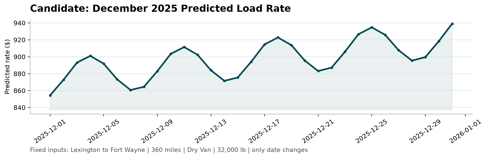

# Spotter Freight Rate Modeling Report

## Executive summary

I built a deterministic, dependency-constrained freight-rate pipeline using
only pandas, NumPy, and Matplotlib. The central validation decision was to
respect the observed time ordering: the 48,000 labeled rows cover January 1
through October 31, 2025, and the 12,000 unlabeled rows cover the immediately
following 61 days, November 1 through December 31. A random split would let
future market conditions inform predictions for earlier loads and would
overstate deployment performance.

The selected model is an engineered ridge regression using the full validation
feature set. On the untouched 61-day September-October holdout it achieved MAE
of **$116.89**, RMSE of **$635.98**, and MAPE of **5.54%**. The official scorer
then validated all 12,000 final predictions and all 31 December chart rows.

## Data exploration and key findings

### Coverage and ordering

- `train_test.csv` contains 48,000 unique loads, 14 columns, and 304 consecutive
  dates from 2025-01-01 through 2025-10-31. Rows and sequential `TR-` IDs are
  chronological.
- `validation.csv` contains 12,000 unique loads, the same 13 predictors (only
  `posted_rate` is absent), and 61 consecutive dates from 2025-11-01 through
  2025-12-31. Sequential `TE-` IDs exactly match the prediction template in
  both set and order.
- Development contains 4,014 unique directed lanes; validation contains 4,214.
  There are 3,478 shared lanes and 736 validation-only lanes, representing
  1,461 validation rows. Validation also introduces eight pickup/delivery city
  labels, while all three equipment types are shared.
- Numeric distributions are broadly stable for distance and coordinates.
  `market_index` is the important exception: validation is 0.93 development
  standard deviations lower on average, reinforcing the need for an
  out-of-time holdout.

### Associations with the target

Distance is the dominant raw predictor: its Pearson correlation with
`posted_rate` is 0.9085 and its rank correlation is 0.9760. The relationship is
not perfectly proportional; `posted_rate / distance` has a -0.3346 correlation
with distance, supporting nonlinear distance terms rather than a single flat
rate-per-mile assumption. Equipment also matters: mean rates are $2,271.55 for
Dry Van, $2,445.09 for Flatbed, and $2,553.64 for Reefer.

The target has a long right tail (maximum $25,533). These rows are positive and
not provably erroneous, so I retained them and tested robust Huber and log-
target alternatives instead of silently deleting legitimate expensive loads.

### Integrity checks

There are no duplicate IDs, exact duplicate rows, duplicate feature rows,
blank categorical strings, invalid dates, non-positive distances, non-positive
targets, infinite values, or out-of-range latitude/longitude values. Each city
maps consistently to one coordinate pair. Reported distance is also coherent
with the coordinates (Pearson correlation of 0.9995 with great-circle
distance, and no reported distance is shorter than great-circle distance).

The complete printed audit and supporting tables are in
`output/eda/exploration.log` and `output/eda/`.

## Data-quality issues and cleaning decisions

| Issue | Development | Validation | Treatment and rationale |
|---|---:|---:|---|
| Missing weight | 300 | 165 | Impute the training median for the same equipment, then the global training median as fallback. |
| Negative weight | 292 | 145 | Take the absolute value and retain a correction flag. The absolute negative-weight quantiles closely match valid positive weights, which is strong evidence of a sign-flip error. |
| Missing `market_index` | 374 | 249 | Use the same-day median available from other loads in the batch, then the training-global median as a defensive fallback. This preserves a strongly date-dependent macro signal. |

All imputers and scaling parameters are fitted without target information from
the evaluation period. Missingness and negative-weight flags are retained as
features. Critical fields that were complete in the supplied data, such as
date and `quote_signal`, fail fast if a future input violates the schema rather
than receiving an unjustified synthetic value.

## Validation and split approach

The final inference horizon is 61 days. I mirrored that horizon in development:

| Partition | Dates | Rows | Purpose |
|---|---|---:|---|
| Inner training | 2025-01-01 to 2025-07-31 | 33,718 | Fit candidates during tuning |
| Tuning | 2025-08-01 to 2025-08-31 | 4,759 | Select regularization, Huber delta, and lane smoothing |
| Final holdout | 2025-09-01 to 2025-10-31 | 9,523 | Select the model family once, using no training feedback |

This expanding-window design uses only earlier rows to predict later rows and
matches the duration and adjacency of the actual November-December forecast.
MAE is the primary selection metric because it directly represents typical
absolute dollar error and is less dominated by rare extreme loads than RMSE.
RMSE and MAPE are reported for transparency and used as tie-breakers.

## Feature engineering

The full model excludes `load_id` and uses:

- raw, square-root, logarithmic, and five train-fitted hinge terms for distance;
- weight, log-weight, distance-weight interaction, and quality flags;
- equipment-specific distance slopes;
- one-hot pickup, delivery, and equipment effects;
- latitude and longitude for generalization to the eight unseen city labels;
- `market_index`, `quote_signal`, squared terms, and distance interactions;
- linear date trend plus weekly and annual sine/cosine terms.

These choices follow the observed nonlinear rate-per-mile behavior, equipment
differences, geographic coverage, temporal ordering, and market shift. Numeric
features are standardized using training-only statistics.

## Model comparison and selection

Every metric below is from the untouched September-October holdout, never the
training fit. Hyperparameters were chosen on August.

| Model | Available features | MAE ($) | RMSE ($) | MAPE |
|---|---|---:|---:|---:|
| **Engineered ridge (selected)** | Full | **116.89** | **635.98** | **5.54%** |
| Robust Huber + lane residual | Full | 134.29 | 641.37 | 5.85% |
| Log-target ridge | Full | 137.27 | 641.52 | 6.06% |
| Robust Huber | Full | 137.39 | 643.03 | 6.03% |
| Robust Huber + lane residual | Common/December | 206.21 | 657.30 | 11.53% |
| Robust Huber | Common/December | 207.94 | 658.97 | 11.62% |
| Engineered ridge | Common/December | 220.91 | 663.61 | 12.85% |
| Median rate per mile | Baseline | 256.95 | 684.25 | 11.63% |
| Global median | Baseline | 1,148.92 | 1,569.42 | 70.15% |

The winning ridge penalty is 1,500. Although robust models were plausible given
the long target tail and performed well on the tuning month, ordinary ridge
generalized best on the final two-month holdout. I therefore followed the
held-out evidence rather than choosing the more elaborate model by preference.
The winner was refit on all 48,000 labeled rows before generating the 12,000
submission predictions. Predicted rates range from $97.26 to $6,708.22 and all
are finite and positive.

## Different feature availability and the December chart

The four files do not have identical schemas. `validation.csv` has every model
predictor from development, but `december_chart_inputs.csv` lacks `pickup_lat`,
`pickup_lon`, `delivery_lat`, `delivery_lon`, `market_index`, and
`quote_signal`. It also has no `load_id`, which is irrelevant to modeling.

Rather than invent six unavailable values, I benchmarked a second feature set
restricted to pickup, delivery, distance, equipment, weight, and date. The best
such model was robust Huber ridge with a smoothed repeated-lane residual. It
filled all 31 days with rates from $854.43 to $939.10. Since only date changes,
the chart reflects the learned weekly pattern plus the forward calendar trend.



The official `score.py` output was:

```text
Validated 12,000 final predictions.
Validated 31 fixed December predictions.
Created chart: output\candidate_december.png
Final validation metrics are calculated by Spotter after submission.
```

## Limitations and monitoring

- Final labels are intentionally unavailable, so the chronological holdout is
  the best measurable proxy, not a guarantee of November-December accuracy.
- The validation `market_index` shift is meaningful. In production I would
  monitor error and feature drift by week and retrain on the newest labels.
- Full-model coordinates help with unseen cities, but the 736 unseen lane
  combinations still increase uncertainty.
- The December chart necessarily uses a reduced model and has materially worse
  holdout MAE than the full model. It should not be interpreted as having the
  same accuracy as predictions where market signals are available.
- No uncertainty bands are shown because the supplied scorer fixes the chart
  format and the assessment asks only for point predictions.

## Reproducibility

The workflow is deterministic and uses the locked Poetry environment. Exact
commands are in `README.md`; output schemas and cleaning behavior are covered
by `tests/test_pipeline.py`. The full model comparison is saved at
`output/model_comparison.csv`.
